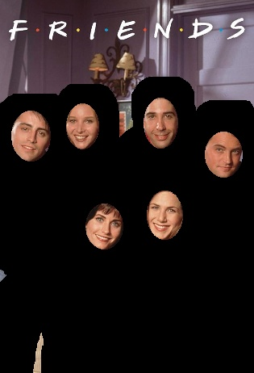

# Halal Watch
A video and image processing tool that detects individuals and applies a black mask to their bodies, leaving only their faces visible. This allows you to watch the videos for their content without being distracted by stuff like fashion being promoted via actors, exposed skin, etc.

## :exclamation: Important

> This, in no way, is intended to support wasting time watching videos.
> Intention is that if you have to watch it, watch the filtered version.

### How to Run
These instructions will get your copy of the project up and running on your local machine for development and testing purposes.
- Install conda following instructions from here: https://conda.io/projects/conda/en/latest/user-guide/install/index.html
- Create conda environment: `conda env create -f environment.yml`
- Activated conda environment: `conda activate purify`
- Download segmentation models from https://docs.ultralytics.com/tasks/segment/#models
- Download face detection model from https://github.com/akanametov/yolov8-face?tab=readme-ov-file
- Run streamlit application: `streamlit run main.py`

#### Demo to Setup and Run

### Technical Details
The pipeline for this project looks like this: `Object Detection -> Segmentation -> Face Detection -> Applying Mask`

- Object Detection: This step identifies all the objects tagged as person in an image/frame. 
- Segmentation: This step maps out the body of the detection person in an image/frame.

Both of these steps are achieved using `yolov8-seg` model from ultralytics (https://docs.ultralytics.com/tasks/segment/#models).

- Face Detection: This is done using a custom-trained face detection model on top of `yolov8`.

